<div align="center">

# ZenithOS

**A 64-bit operating system written from scratch — with a compositing desktop that uses every CPU core.**

Own UEFI bootloader · own SMP kernel · own drivers · own FAT32 · own TCP/IP stack · own TLS 1.3 · own sound system · own web browser · own window system · 24 apps · installs itself to disk

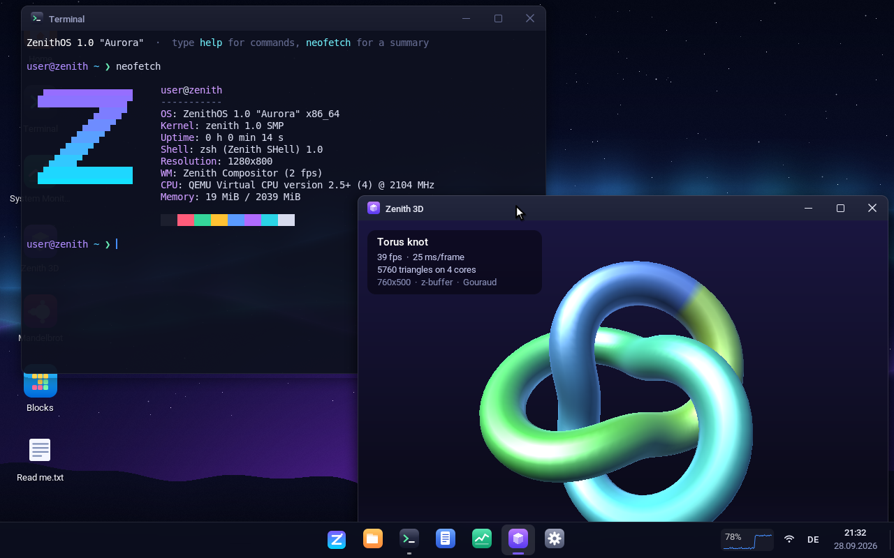

</div>

---

## What it is

ZenithOS boots on UEFI PCs and virtual machines; once the firmware hands
over, the kernel has a modern, animated desktop on screen in under a second. Nothing is borrowed from Linux,
BSD or any other kernel: the bootloader, the memory manager, the scheduler,
the drivers, the network stack, the compositor, the font renderer and all of
the applications are written for this system, in C and a little assembly.

Some highlights:

- **Real multi-core.** Every CPU core is started and runs the preemptive
  scheduler. Apps such as *Zenith 3D* and *Mandelbrot* split their work over
  all cores — the `bench` command shows the speed-up (≈3.6× on 4 cores).
- **A compositor, not a framebuffer painter.** Windows have rounded corners,
  soft drop shadows, fade/slide animations and per-pixel transparency; the
  taskbar and start menu use a blurred "acrylic" look. Only changed regions
  are recomposed, so it stays smooth even in software.
- **Protected user programs.** Programs in `/bin` are ELF executables that run
  in ring 3 in their own address space and talk to the kernel through system
  calls. A crashing program is terminated; the system keeps running.
- **Networking.** Drivers for 11 families of Ethernet adapters — 162 PCI IDs of
  Intel, Realtek, AMD, NE2000, DEC, virtio and VMware chips — plus USB network
  adapters and phones (USB tethering). All adapters run at the same time, each
  with its own DHCP lease; unplug one and traffic moves to the next. Its own
  TCP/IP stack: ARP, IPv4 with checksum verification, ICMP ping, DNS, and TCP
  with many parallel connections, retransmission, flow control and
  out-of-order reassembly. HTTP/1.1 with chunked transfers and gzip; `wget`
  and `curl`. See [Network adapters](#network-adapters).
- **Real HTTPS.** A TLS 1.3 client written from scratch (RFC 8446) with its
  own cryptography: AES-GCM, ChaCha20-Poly1305, SHA-2, HKDF, X25519,
  P-256/P-384 ECDH and ECDSA, RSA-PSS/PKCS#1. Server certificates are
  checked all the way to Mozilla's root certificates (built in), including
  host names, validity dates and CA constraints — a certificate from an
  untrusted authority is refused, not waved through.
- **A web browser.** *Zenith Web* has its own HTML parser and layout engine
  (headings, paragraphs, lists, links, preformatted text, entities, images),
  follows redirects, keeps a history and also opens local `file://` pages and
  folders. Its own PNG (with DEFLATE) and JPEG decoders also serve the image
  viewer and Paint.
- **Disks that keep your files.** An AHCI (SATA) driver, GPT/MBR partitions
  and a read/write FAT32 file system with long file names. The first volume
  is mounted at `/disk`; files are loaded on demand and written back in the
  background. Wallpaper, accent colour, keyboard layout and volume are saved
  there too.
- **It installs itself.** *Install ZenithOS* copies the running system (boot
  loader, kernel, system image) onto a disk — either next to the files on an
  existing FAT32 volume or onto a freshly erased disk with a new GPT and EFI
  System Partition — and the computer then boots from that disk.
- **Sound.** An Intel High Definition Audio driver (codec discovery, automatic
  output routing, DMA streaming) feeds a 32-voice software mixer with a
  synthesizer: eight instruments, system sounds, WAV playback. *Piano* turns
  the keyboard into an instrument.
- **USB.** An xHCI host controller driver with hub support and HID keyboards,
  mice and tablets (report descriptors are parsed, keys auto-repeat), next to
  the classic PS/2 path.
- **Chess on every core.** The chess engine splits its alpha-beta search over
  all CPU cores.
- **Anti-aliased everything.** Text uses Roboto and DejaVu Sans Mono,
  pre-rasterised with hinting; icons are drawn as vectors at any size.

| | |
|---|---|
| 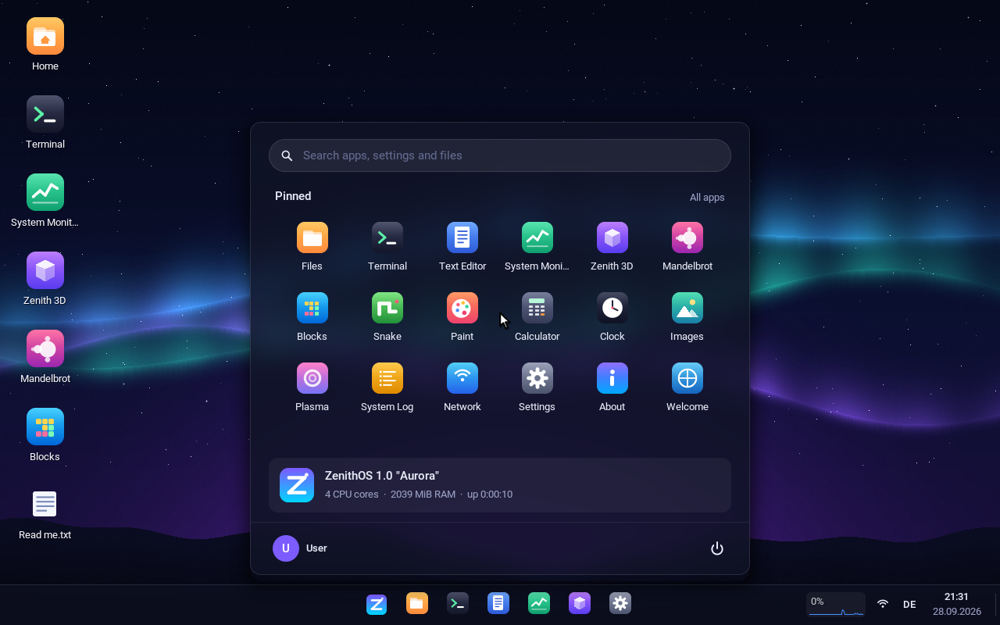 | 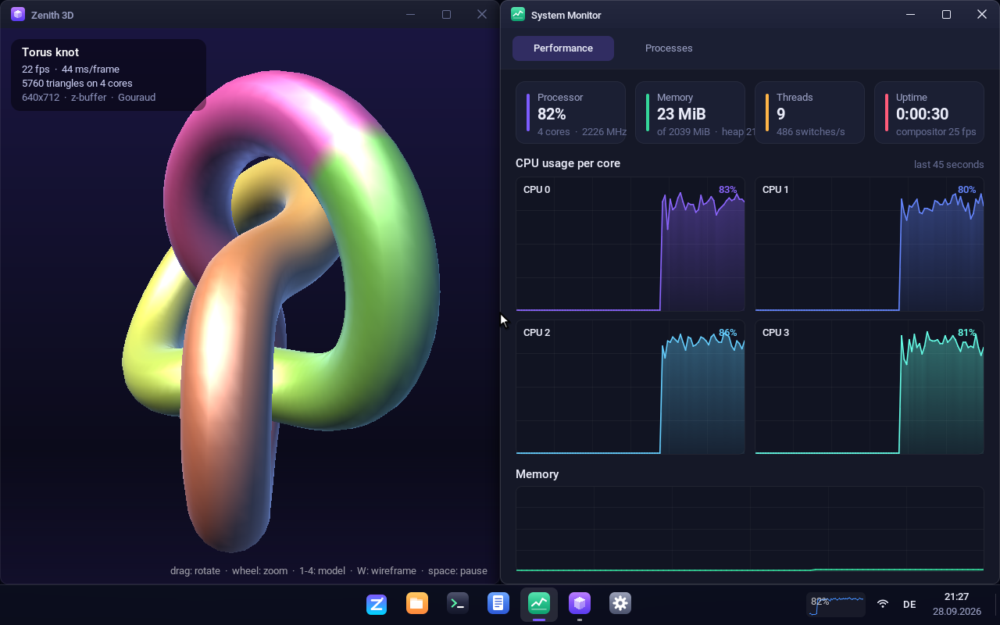 |
| Start menu with live search | 3D renderer loading all four cores |
| 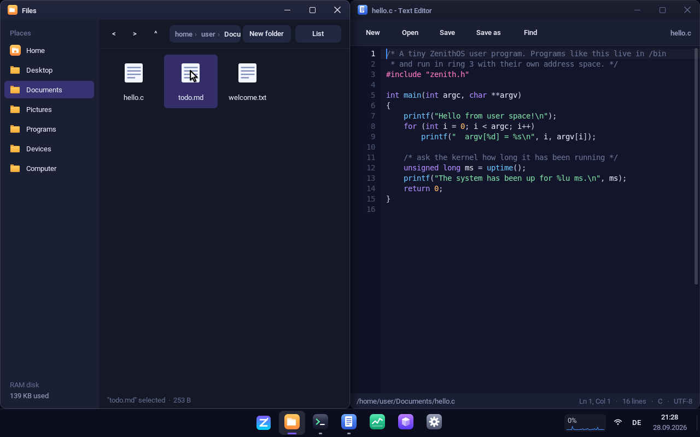 | 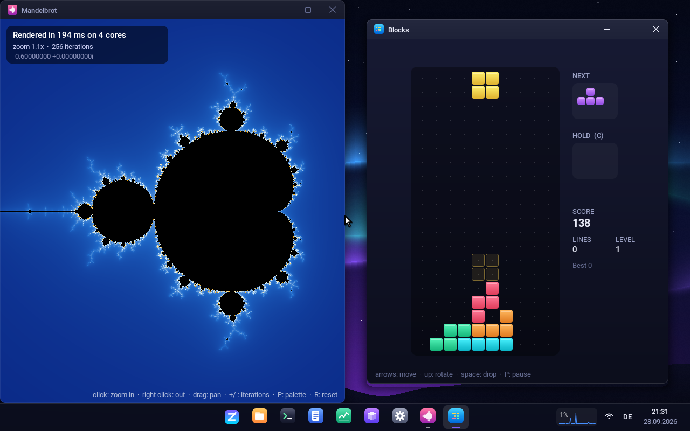 |
| Files and the editor with C highlighting | Parallel Mandelbrot and Blocks |
| 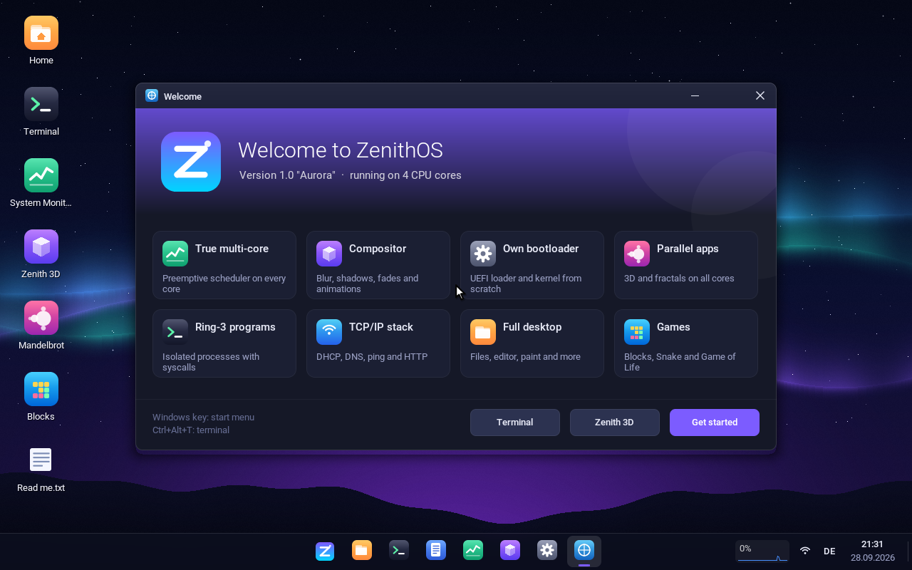 | 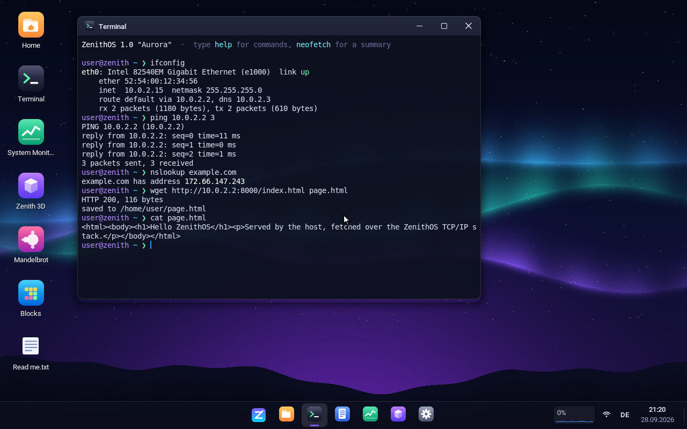 |
| Welcome tour | DHCP, ping, DNS and HTTP from the shell |
| 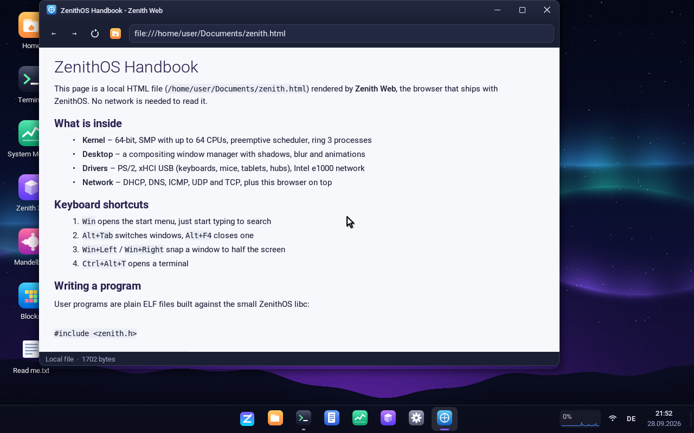 | 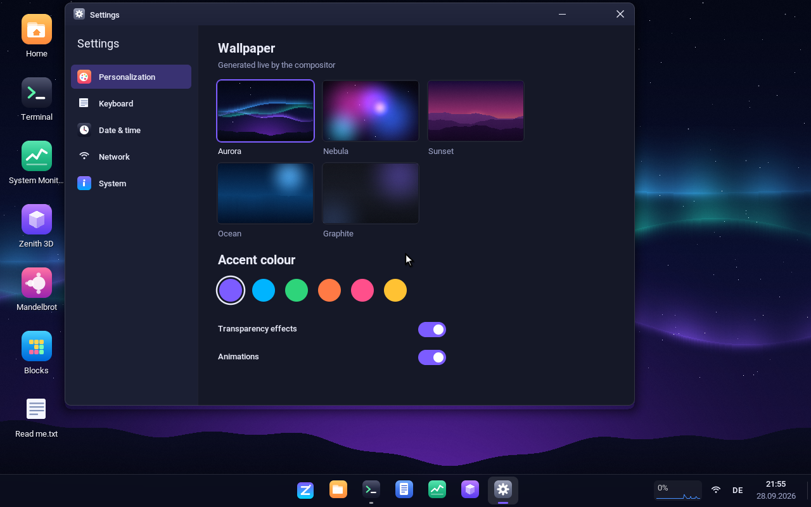 |
| Zenith Web rendering a local HTML page | Settings with live-generated wallpapers |
| 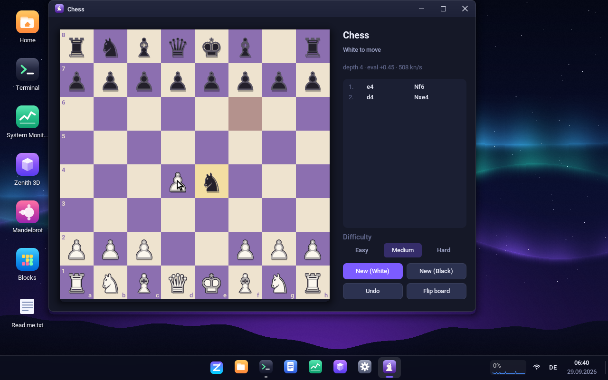 | 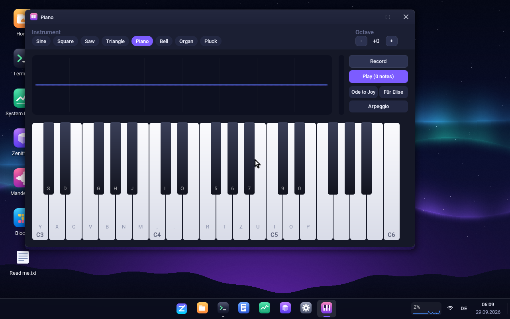 |
| Chess engine searching on four cores | Piano: synthesizer with oscilloscope |
| 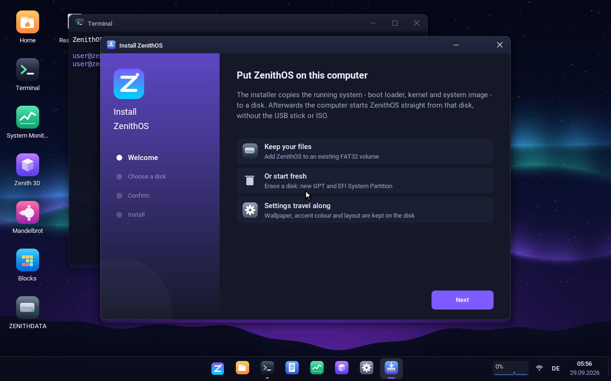 | 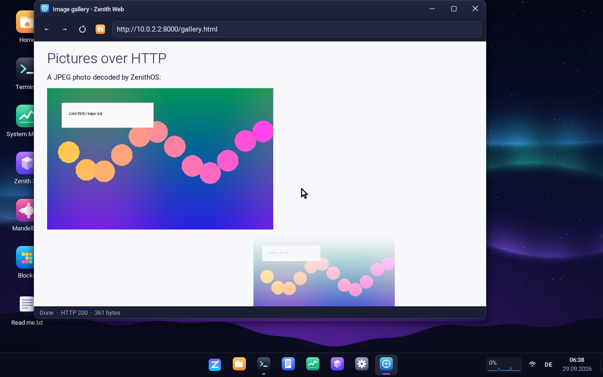 |
| Install ZenithOS onto a disk | JPEG and PNG pictures loaded over HTTP |
| 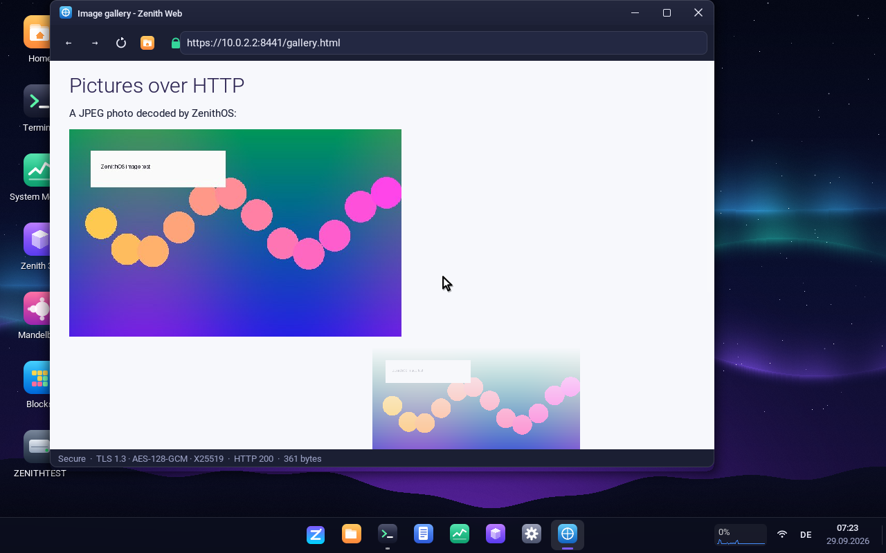 | 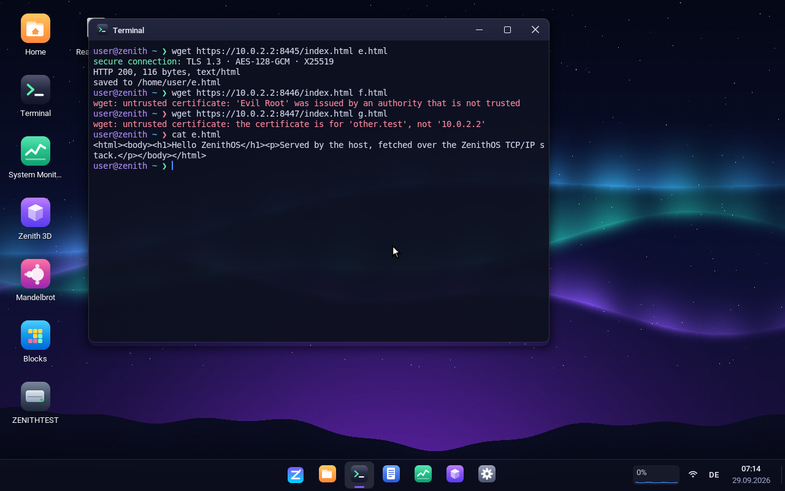 |
| An HTTPS page with pictures (TLS 1.3, padlock) | `wget` over TLS 1.3; untrusted and mismatched certificates refused |
| 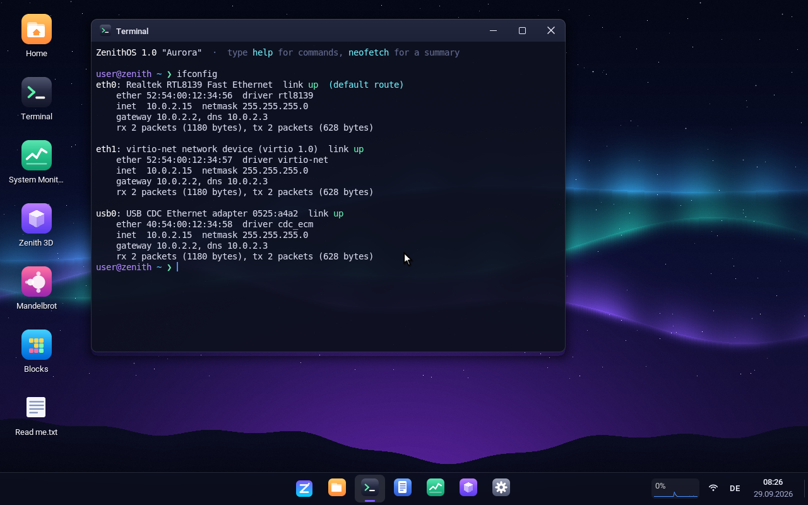 | 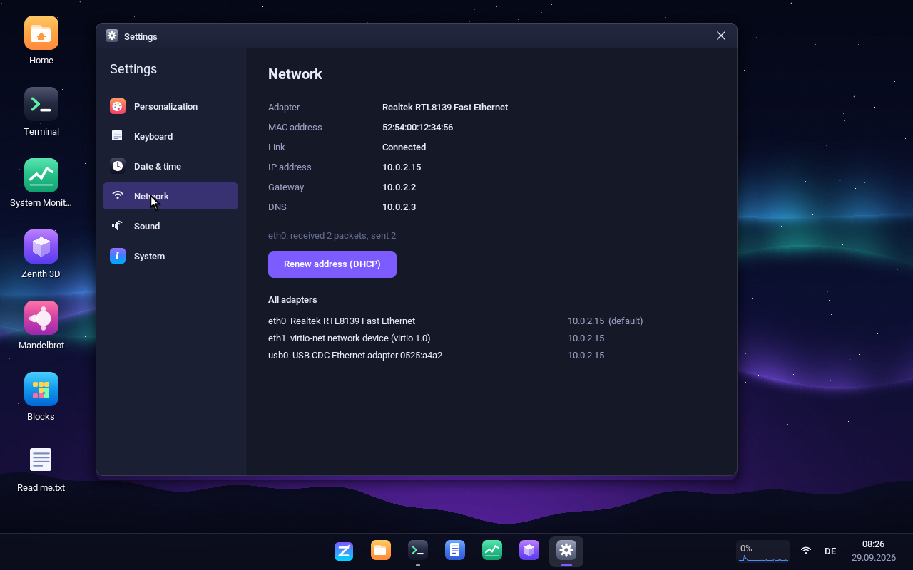 |
| Realtek, virtio and a USB adapter, all configured by DHCP | Settings lists every adapter and the default route |

## Trying it

ZenithOS needs **UEFI** firmware (no legacy BIOS) and an **x86-64** CPU.

### Build

On a Debian/Ubuntu machine:

```sh
sudo apt install build-essential clang lld mtools dosfstools xorriso qemu-system-x86 ovmf python3
make            # -> build/zenithos.iso
make run        # boots the ISO in QEMU: 4 CPUs, network, sound and a 1 GiB SATA disk
make run NIC=rtl8139   # ... with another network adapter (see Network adapters)
```

`make run` creates `build/disk.img` (GPT + FAT32) on first use; it shows up as
`/disk`. After running *Install ZenithOS* (or `install sda` in the terminal),
`make run-disk` boots the installed system from that disk without the ISO.
`make run-fast` boots straight from the build tree without making an ISO;
`make run-usb` attaches the keyboard and mouse over USB (behind a hub) instead of PS/2.

### Virtual machines

- **QEMU:** `make run`, or manually:
  `qemu-system-x86_64 -machine q35 -m 2G -smp 4 -bios /usr/share/ovmf/OVMF.fd -cdrom build/zenithos.iso -nic user,model=e1000`
  (the mouse follows the host pointer thanks to the VMware absolute-pointer
  protocol that QEMU provides).
- **VirtualBox / VMware:** create a 64-bit "Other" VM, **enable EFI**, give it
  2 GB of RAM and a few CPUs, attach the ISO. All of the usual virtual network
  adapters work: Intel PRO/1000, PCnet, virtio-net and VMware's vmxnet3.

### Real hardware

Ready-made images are on the [Releases](../../releases) page (or build one
with `make`). The ISO is a UEFI hybrid image, laid out like the big Linux
distributions' ISOs, so every usual way of making a USB stick works:

- **Rufus** (Windows): GPT, UEFI (non CSM), FAT32, then *Write in ISO Image
  mode* — or *DD Image mode*, both boot.
- **dd** (Linux/macOS) or balenaEtcher:

  ```sh
  sudo dd if=build/zenithos.iso of=/dev/sdX bs=4M status=progress conv=fsync
  ```

Boot the stick's **UEFI** entry with **Secure Boot turned off** (the boot
loader is not signed).

The live system runs from RAM. SATA disks with a FAT32 volume are mounted at
`/disk`, and nothing is written to a disk unless you save files there or run
the installer. Keyboards and mice work over USB (xHCI, also behind hubs) or
PS/2; sound works on Intel HD Audio. For the network, see the adapter list
below — or plug in an Android phone and switch on USB tethering. Press a key during the boot countdown to
pick a different screen resolution; the installer remembers the current one.

## Using it

| Shortcut | Action |
|---|---|
| **Win** / click the Z | Start menu — just start typing to search |
| **Ctrl+Alt+T** | Terminal |
| **Alt+Tab** | Switch windows |
| **Alt+F4** | Close window |
| **Win+←/→**, **Win+↑/↓** | Snap left/right, maximize/restore |
| **Win+D**, **Win+E** | Show desktop, open Files |
| **Print Screen** | Screenshot to `~/Pictures` |
| **Ctrl+Alt+Del** | System Monitor |

The keyboard layout defaults to German (QWERTZ); click **DE** in the taskbar or
run `layout us` to switch.

### Applications

Files · Terminal · Text Editor · System Monitor · Zenith 3D · Mandelbrot ·
Blocks · Snake · Chess · Minesweeper · 2048 · Piano · Paint · Calculator ·
Clock (stopwatch, timer, calendar) · Images · System Log · Zenith Web ·
Network · Settings · Install ZenithOS · About · Welcome — plus the ring-3
programs *Plasma* and *Life* that open their own windows.

### The shell

The terminal runs **zsh** (the Zenith SHell): line editing, history, tab
completion, `>`/`>>` redirection and about 65 built-in commands, for example

```
ls -l   cd   cat   grep   tree   hexdump   cp   mv   rm -r   edit
ps   kill   free   df   uptime   lscpu   lspci   dmesg   neofetch
lsblk   mount   umount   sync   mkfs   install   play   beep   volume
ifconfig   dhcp   netcards   ping   nslookup   wget   curl   sha256sum   calc
```

`open` starts apps, files and web pages (`open http://example.com`).
Anything else is looked up in `/bin` and started as a user process.

## Network adapters

`netcards` in the terminal prints every supported model. Each driver was
tested in QEMU by booting, getting a DHCP lease and downloading 5 MB over
HTTP (and over HTTPS for some) with the SHA-256 checked — every model QEMU
can emulate passed. Chips that no emulator provides are driven the same way
but have not run yet; they are marked below.

| Driver | Adapters | Tested in QEMU |
|---|---|---|
| `e1000` | Intel PRO/1000 8254x: 82540EM/EP, 82541, 82543GC, 82544, 82545, 82546, 82547 (23 IDs) | 82540EM, 82544GC, 82545EM |
| `e1000e` | Intel 82571/2/3/4, 82583 and the chipset LAN from ICH8 to the 300-series chipsets: 82566/7/77/78/79, I217, I218, I219 (50 IDs) | 82574L; chipset parts untested |
| `igb` | Intel 82575, 82576, 82580, I350, I210, I211 (20 IDs) | 82576 |
| `eepro100` | Intel PRO/100: 82557/8/9, 82550/1, 82562 in ICH2 – ICH7 (27 IDs) | all 15 QEMU models (82557A–C, 82558A/B, 82559A–C/ER, 82550, 82551, 82562, 82801) |
| `rtl8139` | Realtek RTL8139 and 13 boards built on it (D-Link, SMC, Edimax, Planex ...) | RTL8139 |
| `r8169` | Realtek RTL8169/8110, RTL8111/8168, RTL8101/8102 (10 IDs) | **untested** — no emulator has it |
| `pcnet` | AMD PCnet Am79C970/970A/971/972/973/975/978 (VirtualBox's default) | Am79C970A |
| `ne2k-pci` | NE2000-compatible PCI cards: RTL8029, Winbond, VIA, Compex, Holtek ... (10 IDs) | RTL8029 |
| `tulip` | DEC 21140/21140A/21142/21143 | 21143 |
| `virtio-net` | virtio 1.0 and legacy virtio (QEMU/KVM, cloud VMs, VirtualBox) | both interfaces |
| `vmxnet3` | VMware vmxnet3 | yes |
| `cdc_ecm`, `rndis` | USB network adapters and phones: CDC Ethernet and RNDIS (Android USB tethering) | both, on QEMU's usb-net |

**Wi-Fi.** ZenithOS has no Wi-Fi driver. A Wi-Fi card needs far more than an
Ethernet card: each chip family (Intel iwlwifi, Realtek, MediaTek, Broadcom,
Qualcomm) wants its vendor's firmware loaded, an 802.11 stack for scanning
and association, and WPA2/WPA3 authentication. No virtual machine emulates a
Wi-Fi card, so none of it could be tested. What works instead: connect an
Android phone with a USB cable and turn on *USB tethering* — the phone shares
its Wi-Fi or mobile connection and ZenithOS sees it as `usb0`.

## Writing programs

User programs are plain C against a small libc (`user/libc/zenith.h`):

```c
#include <zenith.h>

int main(int argc, char **argv)
{
    printf("Hello from ring 3, I am pid %d\n", getpid());

    zwin_t *w = zwin_open(320, 200, "My window");      /* a real window */
    zfill(w, 0, 0, 320, 200, ZRGB(40, 20, 90));
    ztext(w, 20, 20, "Drawn by a user program", 0xFFFFFF, 15);
    zwin_present(w);

    struct z_event ev;
    while (zwin_event(w, &ev, -1) && ev.type != ZEV_CLOSE) {}
    return 0;
}
```

Drop the file into `user/apps/`, run `make`, and it appears in `/bin`.

## How it is built

```
boot/        UEFI bootloader (PE32+, no EDK2): GOP mode setting, ELF loading,
             page tables, memory map, hand-over to the kernel
kernel/
  arch/      GDT/IDT/TSS, interrupt and syscall entry, context switch, SMP start-up
  mm/        physical page allocator, 4-level paging, kernel heap
  proc/      SMP scheduler, wait channels, mutexes, parallel_for, processes, syscalls
  dev/       ACPI, local APIC + I/O APIC, timers, RTC, PS/2 + vmmouse, xHCI USB + HID,
             AHCI SATA, block devices + GPT/MBR, HD Audio + mixer/synth, PCI, serial, power
  fs/        VFS with mount points, RAM file system, tar initrd loader, FAT32, tty
  net/       Ethernet/ARP/IPv4/ICMP/UDP with several interfaces, TCP, DHCP, DNS,
             HTTP/1.1, TLS 1.3, X.509 and the root certificate store
  net/nic/   network drivers: e1000/e1000e/igb, eepro100, rtl8139, r8169, pcnet,
             ne2k-pci, tulip, virtio-net, vmxnet3, USB CDC Ethernet and RNDIS
  crypto/    SHA-2, HMAC/HKDF, AES-GCM, ChaCha20-Poly1305, X25519, P-256/P-384, RSA,
             random numbers
  gfx/       2D graphics (anti-aliased shapes, gradients, blur, shadows), font renderer
  wm/        compositing window manager, desktop shell, widgets, vector icons
  apps/      the built-in applications, including the Zenith Web browser
user/        libc and ring-3 programs
tools/       font baking, symbol table generation, headless QEMU test driver
```

About 35 000 lines of C, assembly and Python.

Pushing a `zenithos-v*` tag makes GitHub Actions build the ISO, run the
tests, boot it in QEMU and publish it as a release
(`.github/workflows/release.yml`).

`tools/qemu-test.py` boots the system headless, types, clicks and takes
screenshots through QMP — that is how the pictures above were made. With
`--nic` it picks the network adapters (`--nic rtl8139,usb-net`), and scripts
can pull a cable (`link n0 off`) or unplug a device (`devdel`).
`make test` builds the cryptography, certificate and TLS building blocks for
the host and checks them against RFC/NIST test vectors, keys and signatures
made by OpenSSL, all 146 Mozilla roots and a test PKI.

## Status

Version 1.0 "Aurora". It boots, it is fun, and it is honest about its limits:

- Only `/disk` (FAT32 on SATA) is persistent; the rest of the tree lives in
  RAM. No NVMe or USB storage yet, and no ext4/NTFS.
- USB covers keyboards, mice, tablets and network adapters (no USB 3 hubs,
  no USB storage).
- No Wi-Fi (see above). The Realtek RTL8169/8111 driver and the Intel chipset
  LAN parts (I217–I219) have not been tried on real hardware yet. USB
  tethering covers RNDIS and CDC Ethernet, not the newer CDC NCM.
- TLS 1.3 only: servers that still speak nothing newer than TLS 1.2 cannot
  be reached. No IPv6 yet. Zenith Web renders HTML structure and pictures
  (PNG, baseline JPEG) — no CSS or JavaScript.
- Sound needs an Intel HD Audio controller; there is no audio input.

## Credits

Written by **jojojonas169-debug** with [Claude Code](https://claude.com/claude-code).
ZenithOS replaces the earlier EliteOS project in this repository.

Fonts: [Roboto](https://github.com/googlefonts/roboto) (Apache License 2.0) and
[DejaVu Sans / Sans Mono](https://dejavu-fonts.github.io/) (Bitstream Vera license;
the chess pieces come from DejaVu Sans), see `assets/fonts/`.
Root certificates: Mozilla's CA list from the `ca-certificates` package
(`assets/certs/ca-bundle.pem`, MPL 2.0).
