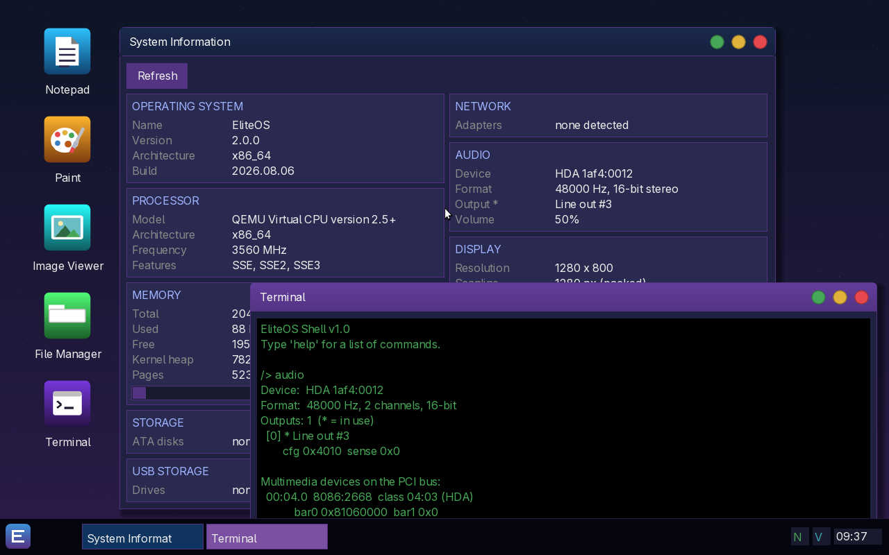

<div align="center">

# EliteOS

**An x86-64 operating system written from scratch.**

No Linux, no BSD, no kernel forked from anything. Own bootloader, own kernel,
own drivers, own desktop, own applications.

[**Download the latest release →**](../../releases/latest)



</div>

---

## What it is

EliteOS boots on UEFI machines from a USB stick or a DVD, brings up its own
graphical desktop, and runs its own programs. Everything above the firmware is
written for this system: the memory manager, the scheduler, the filesystem, the
drivers, the window system, the applications.

It is a hobby operating system, and an honest one — what is listed below works,
and what does not work is not listed.

## Trying it

**From a USB stick.** Download the ISO from the releases page and write it to a
stick, then boot the machine from it. The system runs entirely from the stick;
nothing on your disks is touched unless you start the installer yourself.

```
# Linux - replace sdX with your stick, and be sure about which one it is
sudo dd if=EliteOS-x86_64.iso of=/dev/sdX bs=4M status=progress conv=fsync
```

On Windows, [Rufus](https://rufus.ie) or [balenaEtcher](https://etcher.balena.io)
will do the same thing.

**In a virtual machine.** EliteOS needs UEFI firmware — it will not boot under
legacy BIOS.

```
qemu-system-x86_64 \
  -drive if=pflash,format=raw,readonly=on,file=/usr/share/OVMF/x64/OVMF_CODE.4m.fd \
  -drive if=pflash,format=raw,file=OVMF_VARS.fd \
  -cdrom EliteOS-x86_64.iso -m 2G -smp 4 \
  -device intel-hda -device hda-output
```

In VirtualBox or VMware, enable EFI in the machine's settings before booting.

**Installing to a disk.** The desktop has an installer that partitions a disk,
writes the system to it and sets up a user account. It will happily install to a
virtual disk, which is the sensible place to try it first.

## What is in it

**Boot and core.** A UEFI bootloader that sets up the graphics mode and hands
over to a 64-bit kernel. Physical and virtual memory management, a heap, a
pre-emptive multitasking scheduler, ring-3 user processes with their own address
spaces, and a syscall interface.

**Hardware.** PCI enumeration, AHCI and ATA storage, FAT filesystems, PS/2 and
USB keyboard and mouse, RTC, ACPI power-off, serial, networking, and a full
audio stack — Intel HD Audio with AC'97 underneath it, mixing several streams at
once and exposed to programs as `/dev/dsp` with the standard OSS interface, so a
C program written for any other Unix plays sound here unmodified.

**Desktop.** A composited window system with a taskbar, start menu, wallpapers,
a file manager with context menus, and settings that persist across reboots.

**Applications.** Terminal, text editor, notepad, file manager, paint program
with a colour wheel, image viewer, archiver, calculator, calendar, clock,
weather, music player, screenshot tool, task manager, disk manager, log viewer,
system information, settings, an installer, and an assembler that produces
programs you can run on the spot.

**Programs of your own.** Both native EAL executables and standard ELF binaries
run in ring 3. Write one in C or in assembly, and the graphics, filesystem and
sound interfaces are there without a line of code specific to this system.

## Status

Beta. It boots, it runs, and it is under active development — which also means
you may find rough edges. Bug reports are welcome in
[Issues](../../issues); a photograph of the screen and the machine's hardware
is usually enough to work from.

Around 230,000 lines of C, C++ and assembly.

## Credits

Written by **jojojonas169-debug**, with development assistance from
[Claude Code](https://claude.com/claude-code).
